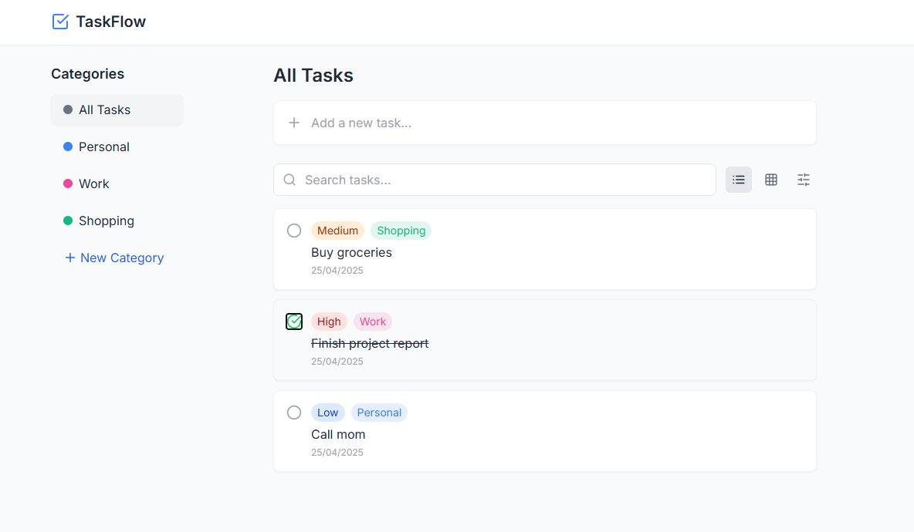

# TaskFlow - Todo App

**TaskFlow** est une application de gestion de tâches construite avec **React**, **Vite** et **TypeScript**. Elle permet aux utilisateurs de créer, organiser, et suivre leurs tâches à travers différentes catégories, avec une interface réactive et agréable.


## About The Project



There are many great README templates available on GitHub; however, I didn't find one that really suited my needs so I created this enhanced one. I want to create a README template so amazing that it'll be the last one you ever need -- I think this is it.

Here's why:
* Your time should be focused on creating something amazing. A project that solves a problem and helps others
* You shouldn't be doing the same tasks over and over like creating a README from scratch
* You should implement DRY principles to the rest of your life :smile:

Of course, no one template will serve all projects since your needs may be different. So I'll be adding more in the near future. You may also suggest changes by forking this repo and creating a pull request or opening an issue. Thanks to all the people have contributed to expanding this template!

Use the `BLANK_README.md` to get started.

<p align="right">(<a href="#readme-top">back to top</a>)</p>

## Fonctionnalités

- **Ajout de tâches** : Crée des tâches avec un titre et assigne-les à une catégorie.
- **Gestion des catégories** : Organise tes tâches par catégorie (ex. : personnel, travail, shopping).
- **Marquage des tâches** : Marque des tâches comme terminées ou non terminées.
- **Suppression et modification des tâches** : Supprime ou modifie les tâches existantes.
- **Menu mobile** : Accède à l'application via un menu mobile pour une meilleure expérience sur petits écrans.
- **Animations fluides** : Utilisation de **Framer Motion** pour une interface animée et agréable.
- **Icônes intuitives** : **Lucide React** fournit des icônes modernes et simples.

## Prérequis

Avant de commencer, assure-toi d'avoir installé **Node.js** et **npm**.

- **Node.js** >= 16.0.0
- **npm** >= 8.0.0

## Installation

1. Clone ce repository sur ton ordinateur.

   ```bash
   git clone https://github.com/ton-utilisateur/ton-repository.git
